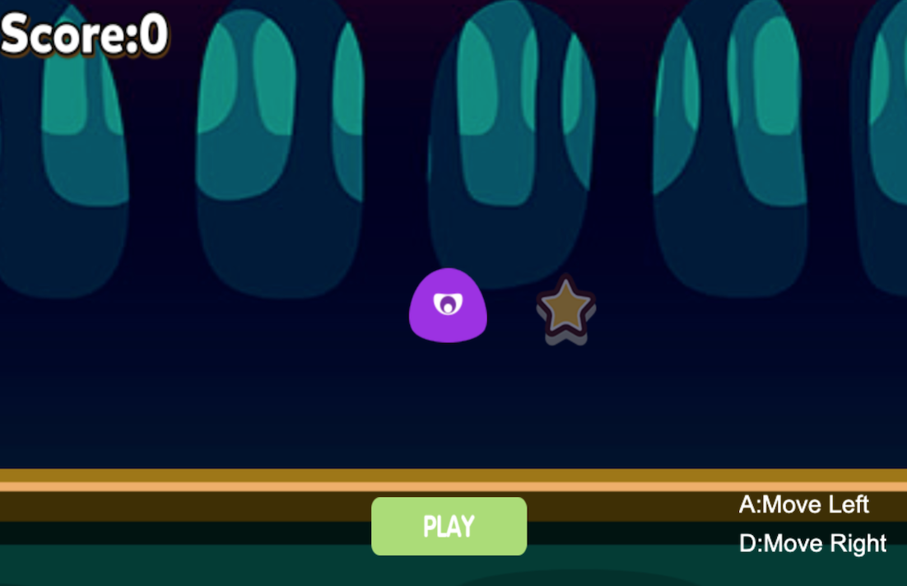
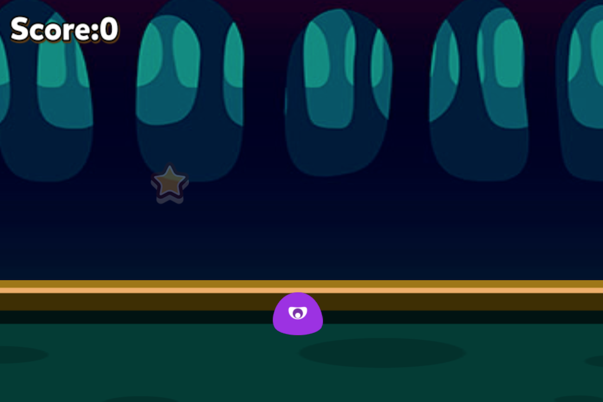
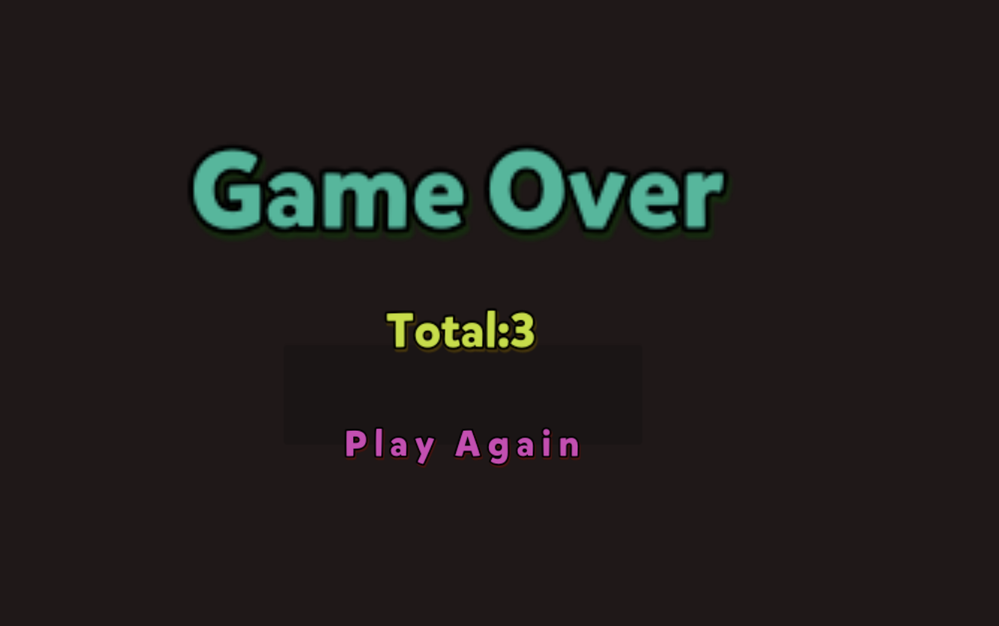

It use the CocosCreator and Cocos2D-JS to implement for practice purpose.  
All project initial configs and related resource can be found in repository of offical Cocos2D.  

Currently, you can play game and use keyevent A(left) and D(right) to control the moving direction.  

